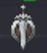
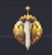
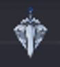
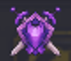
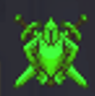
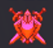
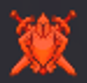

# Rated Stats – Achievements (RatedStats_Achiev)

PvP achievement + rank tracking on tooltips — instantly spot **Gladiators, Legends, Strategists, Rank 1s** (plus Duelist/Rival/etc) on mouseover/target/party/raid, **guild roster**, and **LFG leaders/applicants**.

**Download (recommended):** https://www.curseforge.com/wow/addons/rated-stats-achievements  
**Core addon (Rated Stats):** https://www.curseforge.com/wow/addons/rated-stats

---

## What this addon does

Rated Stats – Achievements adds a “Rated Stats – Achievements” section to player tooltips, showing:
- A clear **Highest PvP Rank** line (season-aware)
- A compact **icon + count row** showing rank history across common PvP titles/ranks

This is designed to make it obvious who you’re queuing with / inviting / fighting — without tabbing out. 

---

## Where it shows

The achievement block appears when you interact with players through:
- Unit tooltips (mouseover/target/focus)
- Party/Raid frames / UnitFrames
- Guild roster lists
- LFG Search (leader tooltip)
- LFG applicants (applicant popout / rows)

---

## Icon Legend (Titles)

|  |  |  |  |  |  |  |  |  |   |
|---|---|---|---|---|---|---|---|---|---|
| Combatant I / II | Challenger I / II | Rival I / II | Duelist | Elite | Strategist | Gladiator | Legend | Rank 1 | Hero of the Horde / Alliance |

---

## Optional announcements (settings)

If enabled in settings, the addon can:
- Print your group’s detected achievements when you queue (on the “queued for X” system message)
- After joining some PvP modes, it can also print a friendly highest-achievement summary

---

## Data updates & memory note

- The achievement dataset is updated via a **daily API update** — keep the addon updated.
- Memory usage can look “large” in the addon list because it includes a growing player dataset. If you hit issues, disable it and report it.

---

## Gallery

Source gallery (CurseForge): https://www.curseforge.com/wow/addons/rated-stats-achievements/gallery

<strong>Click to expand screenshots</strong>

 

<strong>Default achievement tooltip</strong>

  

<strong>LFG leader + member achievements</strong>

  

<strong>LFG applicant tooltip</strong>

  

<strong>Guild roster tooltip</strong>

---

## Bugs / Requests

Open an issue here:
https://github.com/liamnap/RatedStats_Achiev/issues
